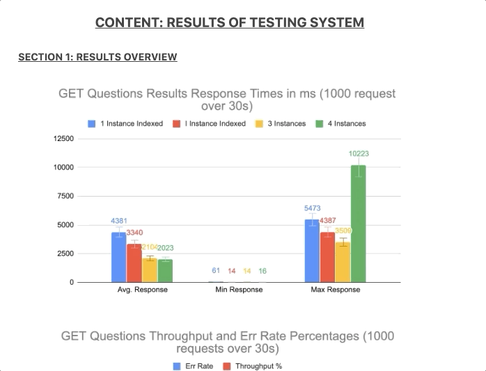
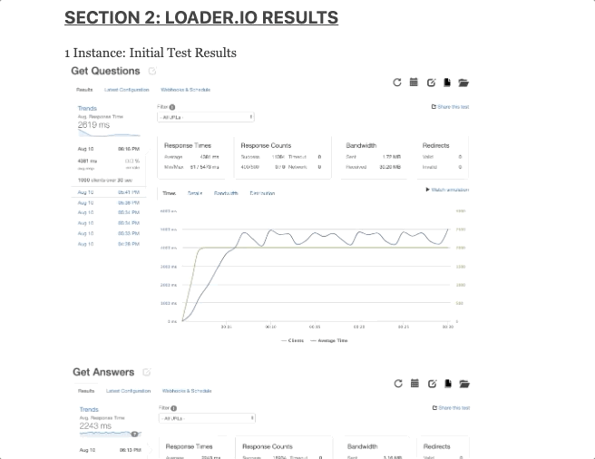

# Green Field Questions and Answers API Documentation

<!-- INSERT GIF OF OVERALL APP HERE -->

The goal of this project was to design a system that can at least handle 100 requests per second across 8 endpoints to serve a Questions and Answers component for an e-commecce application. More details regarding building out the API can be found in the [Engineering Journal](#engineering-journal) and results from tesing out the system can be viewed in at the bottom of the engineering journal section.

Data to be the generated came from 3 csv's with millions of records. The provided csv's were one containing questions, answers, and the third was photos associated with specific a specific answer. Due to the relational nature of the data, Postgres was chosed as the database. An ETL process was implemented using the fs module to consolidate answer data within a single file.

Postgres was used as the database, Docker was used in order to quickly horizontally scale the system.

> - 🐘 Postgres
> - 🐋 Docker
> - 📕 Reddis

## Table of Contents

  - [Table of Contents](#table-of-contents)
  - [Installing-Dependencies](#installing-dependencies)
  - [Technologies-Used](#technologies-used)
  - [Requirements](#requirements)
  - [Routes](#routes)
  - [API](#api)
  - [Engineering Journal](#engineering-journal)
  - [Notes](#notes)

## Installing-Dependencies

> Navigate to the root directory and run the following scripts to run locally

- `npm install` - install dependencies
- `npm start` - start the server in production

> Alternatively run the following script to simultaneously run the server and build

- `npm run dev` - concurrently start the server and build the front end

* Navigate to http://localhost:4000/

## Technologies-Used

> Back-End

- [Node.js](https://nodejs.org/en/)
- [Express](https://expressjs.com)
- [Postgres](https://www.postgresql.org/)
- [Docker](https://www.docker.com)
- [Redis](https://redis.io/)

> Continuous Integration

- [Travis](https://travis-ci.org/)

> Testing Suite

- [Jest](https://jestjs.io/docs/en/api)
- [Frisbby](https://www.frisbyjs.com/)

## Requirements

Ensure that the following modules are installed before running `npm install`

- Node v10.13.0 or higher

## Routes

> Listed are available routes that can be handled by the API.

| Request Type | Endpoint                          | Returns                                                                                                               | Status |
| ------------ | --------------------------------- | --------------------------------------------------------------------------------------------------------------------- | ------ |
| GET          | /qa/:productId                    | An object containing questions related to a particular product along with answers/photos associated with the question | 200    |
| GET          | /qa/:questionId/answers           | An object cotaining answers and photos related a question                                                             | 200    |
| POST         | /qa/:productId                    | Nothing is returned but serves a route to post questions about specific product                                       | 201    |
| POST         | /qa/:questionId/answers           | Nothing is returned but this route serves handling posting answers about a specfic question                           | 201    |
| PUT          | /qa/question/:question_id/helpful | A counter associated with the question is incremented up                                                              | 204    |
| PUT          | /qa/question/:question_id/report  | The question will not get deleted but it will no longer be returned upon making a GET request for the questions route | 204    |
| PUT          | /qa/answer/:answer_id/helpful     | A counter associated with the question is incremented up                                                              | 204    |
| PUT          | /qa/answer/:answer_id/report      | The specific response will no longer be returned  upon making a GET request to the answers route                      | 204    |

## API

> TODO: ADD NOTES HERE

## Engineering Journal

> Detailed notes on the project including recorded times at different intervals can be found viewed via my [engineering journal](https://gist.github.com/cali3192/e8b73d36df18e0c1cd5519d0e940983a#file-2019-08-05-md)

> Initial Data and results from testing the system can be viewed in charts and tables are provided in this [results page](https://www.evernote.com/l/Arqq2XYRMLZG6pQQ-2lcBz2d91dkcKOIV8E).

> Below are examples of the data that was gathered at different intervals of the project.
> System Overview:

> Loader.io Tests

## Notes

> **IMPORTANT: development vs. production**
